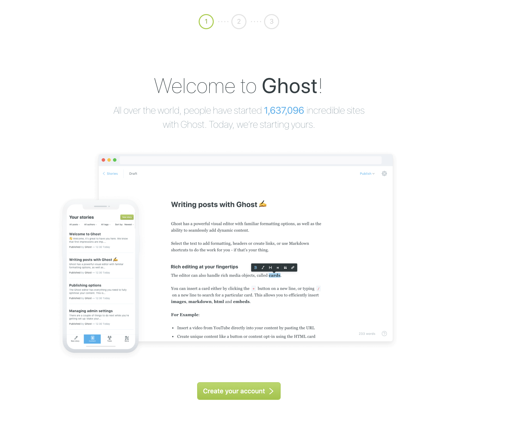
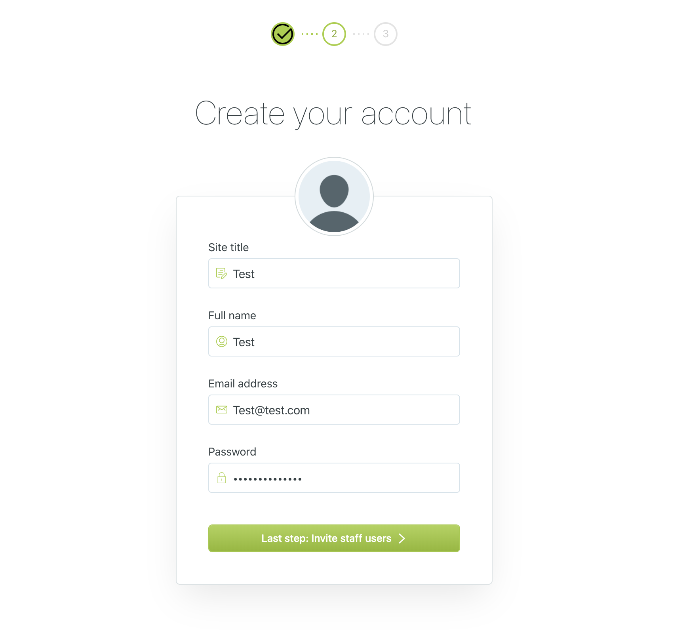
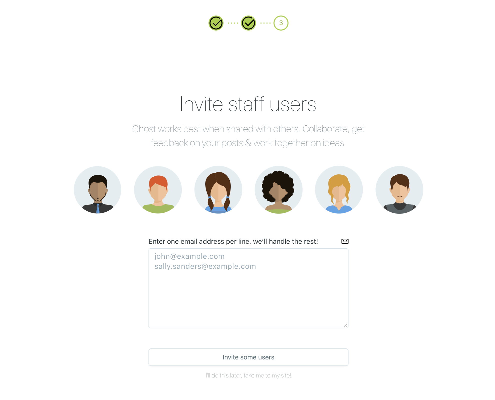
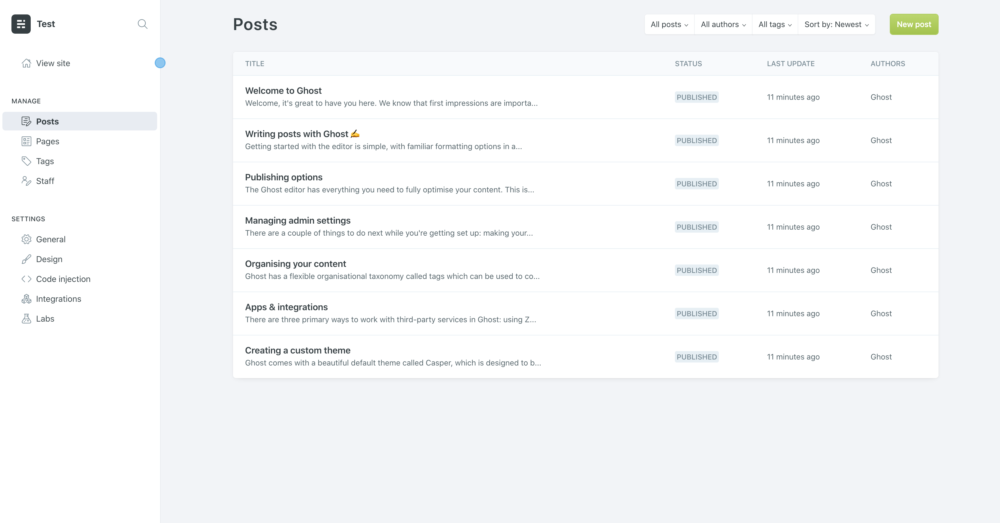
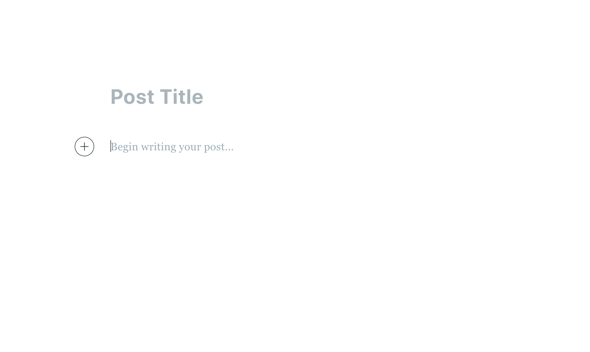
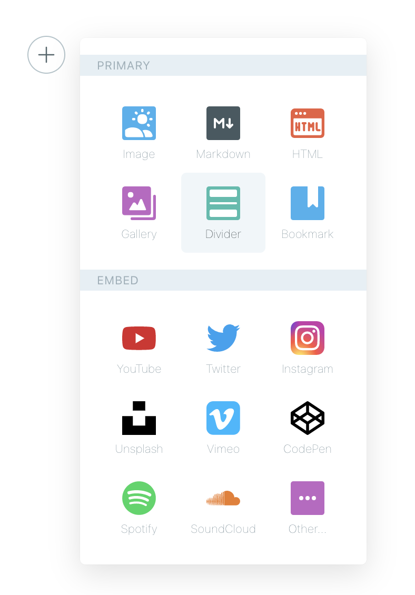
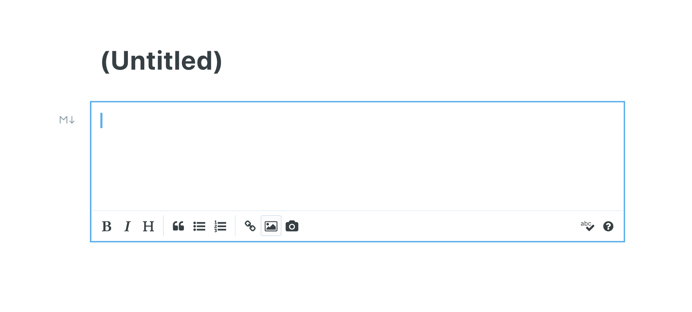
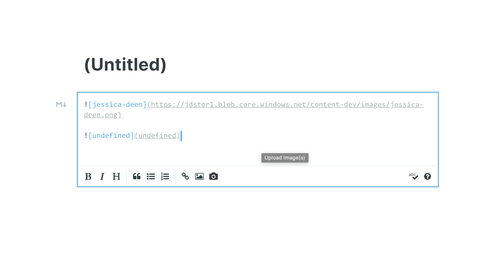

# Testing Notes

There are two projects:
- This one (Used to test the storage adapter in a container instance of Ghost)
- [Ghost-Azurestorage](https://github.com/jldeen/ghost-azurestorage) (The actual storage adapter)

From within [Ghost-Azurestorage](https://github.com/jldeen/ghost-azurestorage) project run:

`npm pack` and `cp ghost-storage-azure-1.1.1-0.tgz ../ghost-storage-docker`

This will create a tarball of the storage adapter and copy it to the testing repo folder.

Now, from within this project (ghost-storage-docker) run:

`docker build --build-arg mode=development -t ghost-azure-test .` (This will build the image with the local tarball you packed.)

`docker rm -f ghost` (This is optional and will remove the container if it's running.)

`docker run --name ghost -p 8085:2368 -e url=http://localhost:8085 ghost-azure-test` (This will run the container)

## Testing within the container
Once the container is up, you will need to create a login to get to the admin panel. From there you can navigate to posts. Start from `http://localhost:8085/admin` and click "create account"

Fill in test details and click "Last step".

You don't have to fill anything in for "staff" just click the very hard to see "I'll do this later" link

From there you'll see an admin page.

You'll see posts in the left hand corner, go ahead and click that to get to the posts page.

From there, click "New post in the top left hand corner to get to the draft a new post page.

Click the plus button to chose the type of content you wish to add.

Select "markdown" and then from within the markdown editor, select image. Upload an image (png, jpg, gif, etc.)

Here's an example of a working upload (png, jpg, etc) and a non working (undefined upload - gif). One returns a link and one says "undefined"

### Expected outcome:
- All supported images: (anything but gif, svg, ico) get uploaded and placed into the root directory of storage, as well as the size folder separated by 4 sizes.
- Unsupported images still get upload, but are not resized.
- Image URL is returned to ghost and available for use in the markdown editor.